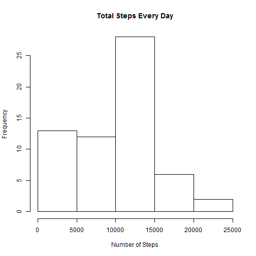
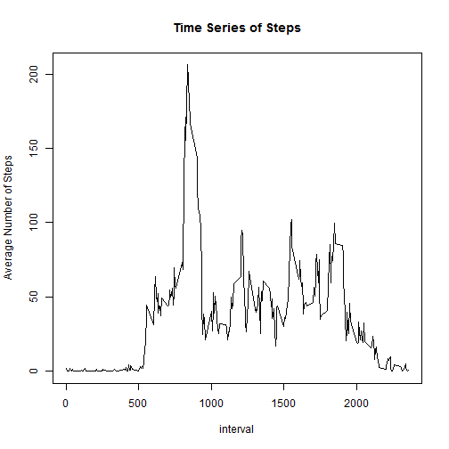
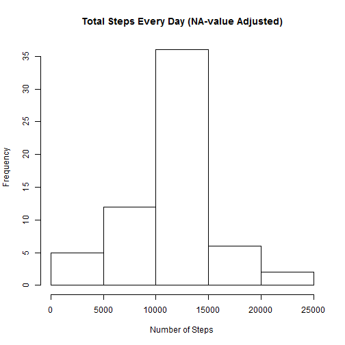
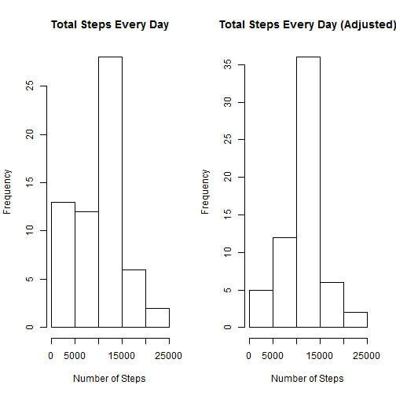

Reproducible Research: Peer Assessment 1
===========================================
###Q1:What is mean total number of steps taken per day?

First we load the data

```r
setwd("E:/coursera/R_Programming/Reproducible Research/Project1")
data = read.csv("activity.csv")
```

Then process the data with dplyr package and generate the histgram

```r
library(dplyr)
sumStep <- summarise(group_by(data,date),sum(steps,na.rm=TRUE))
colnames(sumStep) <- c("date","sum_step")
hist(sumStep$sum_step,main = "Total Steps Every Day",xlab="Number of Steps")
```

 

```r
mean_step <- mean(sumStep$sum_step)
median_step <- median(sumStep$sum_step)
```
The mean of total number of steps taken per day is 9354.2295082
The median of total number of steps taken per day is 10395

###Q2:What is the average daily activity pattern?

Again we process the data with dplyr package and generate the time series plot

```r
avgStep <- summarise(group_by(data,interval),mean(steps,na.rm=TRUE))
colnames(avgStep) <- c("interval","avg_step")
plot(avgStep$interval,avgStep$avg_step,type="l",xlab="interval",ylab="Average Number of Steps",main = "Time Series of Steps" )
```

 

```r
sortStep <- arrange(avgStep,desc(avg_step))
sort_s <- sortStep[1,1]
```
The 5-minute interval, 835, contains the maximum number of steps

###Q3:Imputing missing values

**Calculate and report the total number of missing values in the dataset**

```r
num_na <- sum(is.na(data$steps))
```
The total number of missing values is 2304

**Devise a strategy for filling in all of the missing values in the dataset.**
**Create a new dataset that is equal to the original dataset but with the missing data filled in**

Use the mean for that 5-minute interval to fill in the missing values

```r
data_new <- data
dim_data <- dim(data_new)
Len = dim_data[1]
for(i in 1:dim_data[1]){
  if(is.na(data_new$steps[i])){
    data_new$steps[i] <- avgStep[avgStep$interval==data_new$interval[i],2]
  }
}
```

**Make a histogram of the total number of steps taken each day and Calculate and report the mean and median total number of steps taken per day**

```r
sumStep_new <- summarise(group_by(data_new,date),sum(as.numeric(steps)))
colnames(sumStep_new) <- c("date","sum_step_new")
hist(sumStep_new$sum_step_new,main = "Total Steps Every Day (NA-value Adjusted)",xlab="Number of Steps")
```

 

```r
mean_step_new <- mean(as.numeric(sumStep_new$sum_step_new))
median_step_new <- median(as.numeric(sumStep_new$sum_step_new))
```
The mean of total number of steps taken per day is 1.0766189 &times; 10<sup>4</sup>

The median of total number of steps taken per day is 1.0766189 &times; 10<sup>4</sup>

Apparently, the mean and median is different from the original ones calculated from unadjusted data.

To further compare the difference betweent two histograms, we put them together.

```r
par(mfrow=c(1,2))
hist(sumStep$sum_step,main = "Total Steps Every Day",xlab="Number of Steps")
hist(sumStep_new$sum_step_new,main = "Total Steps Every Day (Adjusted)",xlab="Number of Steps")
```

 
After the missing values are filled, the frequency of less-total-step(0-5000) days is decreased and the frequency of total steps between 10000 and 15000 is increased, because the filling of these values makes the total steps become larger.

###Q4:Are there differences in activity patterns between weekdays and weekends?

**Create a new factor variable in the dataset with two levels -- "weekday" and "weekend" indicating whether a given date is a weekday or weekend day**

```r
data_week <- mutate(data_new,week_day= "weekday")
for(i in 1:Len){
  if(weekdays(as.Date(data_week$date[i]))=="ÐÇÆÚÈÕ"|weekdays(as.Date(data_week$date[i]))=="ÐÇÆÚÁù"){
    data_week$week_day[i]="weekend"
  }
}
data_week$week_day <- as.factor(data_week$week_day)

by_weekday <- summarise(group_by(data_week,week_day,interval),mean(as.numeric(steps)))
colnames(by_weekday) <- c("weekday","interval","mean_step")
```

**Make a panel plot containing a time series plot of the 5-minute interval and the average number of steps taken, averaged across all weekday days or weekend days.**

```r
library(lattice)
xyplot(by_weekday$mean_step ~ by_weekday$interval |  by_weekday$weekday, layout = c(1,2),type="l",xlab="Interval",ylab="Number of steps")
```

 

